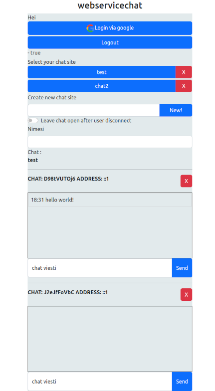

# Service-chat (admin)
 
Websivulle laitettava chat jolla voi olla 
yhteydessä websivun ylläpitäjään/asiakaspalveluun. 
Admin on ylläpitäjää varten oleva sivu josta voi hallinoida 
ja chattailla websivuilla kävijöiden kanssa. 
Ylläpito edellyttää Googlen tunnuksia 
 
Backend: https://github.com/reeppi/servicechat-backend 
Client: https://github.com/reeppi/servicechat 
 
 
Avainsanat :  React, Typescript, websockets 

tuomas.kokki@outlook.com
